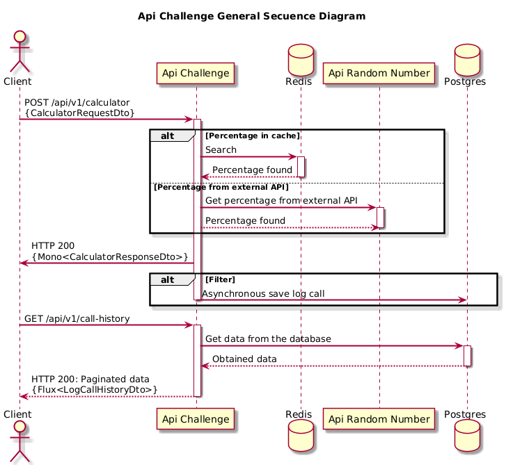

# Tenpo Challenge

---
## Resumen

API RESTful Reactiva que permite realizar la suma de dos números con un incremento porcentual, recuperando el porcentaje de una API externa.
La lógica central implica recibir dos números, sumarlos y aplicar un aumento porcentual.

**num1:** 5, **num2:** 5

**Porcentaje obtenido de la API externa:** 10 

**Resultado:** `(5 + 5) + 10% = 11.0`

---

## Stack Tecnológico

- Java 21
- Spring Boot 3.4
- Spring Web Flux 6.2
- jUnit + Mockito 5
- Lombok 1.18
- Mapstruct 1.6
- Gradle 8.13
- Netty 4.1
- Openapi 2.8 (with Swagger UI for Spring Webflux)
- Resilience4j 2.2
  - resilience4j-ratelimiter-2.2.0
  - resilience4j-retry-2.2.0
- PostgreSQL 17
- Redis 7
- Docker + Docker Compose


---

## Funcionalidades

- El porcentaje es obtenido desde un servicio externo ([Enlace a generador de números aleatorios](https://www.randomnumberapi.com/api/v1.0/random?min=1&max=100&count=1>)).
- Se implementa **caché temporal de 30 minutos** para el porcentaje.
- Soporte de reintentos ante fallos del servicio externo (hasta 3 intentos). 
- Si el servicio externo falla y no hay valor cacheado, se retorna un error apropiado.
- Registro asíncrono de todas las llamadas a los endpoints, persistido en una base de datos **PostgreSQL**. 
- Si el registro de la llamada falla, la ejecución del endpoint no se ve afectado. 
- Implementación de un endpoint para consultar el historial de todas las llamadas realizadas a los endpoint. Paginable.
- Límite de 3 solicitudes por minuto por usuario (Rate Limiting). Si se alcanza el máximo RPM, el servicio retorna un error apropiado.
- Manejo adecuado de errores HTTP (códigos y descripciones para 4XX y 5XX).
- Cobertura de pruebas unitarias.
- Se genera documentación utilizando **Swagger**
- Se incluye colección Postman para realizar pruebas del servicio.
- Contenedores de API y bases de datos desplegables vía **Docker Compose**.
- Se implementa el servicio utilizando el paradigma de programación reactiva (Spring Webflux)
- Se almacena el entregable en Github.
- Se publica en Docker Hub la imagen docker generada de la aplicación.
- Se adjunta archivo docker-compose.

---

## Arquitectura

Se adjunta diagrama de secuencias general de la API, donde se ilustran las secuencias de invocación por cada enpoint. 



---

## Despliegue de la API 

### 1. Pre-requisitos

* Docker Engine
* Docker Compose

Verificar la instalación:
```bash
docker -v
docker compose version
```

### 2. Clonar el repositorio

```bash
git clone https://github.com/manusaez/tenpo-challenge.git
```

### 3. Iniciar docker compose
Utilizar docker compose para iniciar la API, obteniendo la imagen de la aplicación ya creada desde Docker Hub.
Para esto ubicarse en el directorio raíz del proyecto y ejecutar la siguiente instrucción:

```bash
docker compose up
```

Si se desea construir y levantar la aplicación junto a la imagen de PostgreSQL y Redis, se debe **des-comentar la línea número 3 del archivo `docker-compose.yml`**
y se debe ejecutar la siguiente instrucción:

```bash
docker compose up --build 
```

### 4. Probar la aplicación

En el directorio `/resources/postman` que se encuentra en el directorio raíz del proyecto, se adjunta colección Postman para realizar pruebas de la aplicación.
Dentro de la colección Postman se incluye un request para invocar la API externa con la que se puede obtener un número aletaorio, que para este caso práctico se interpreta como el porcentaje. 

### 5. Acceso a documentación Swagger

<http://localhost:8080/swagger-ui/index.html>

---

## Imagen en Docker Hub

```bash
docker pull manusaez/tenpo-challenge:latest
```

## Consideraciones

* Se incluyó plugin Jacoco para medir cobertura de los tests unitarios.

* Para efectos de desarrollo, se adjunta además archivo docker compose para desplegar sólo la imagen docker de PostgreSQL y Redis. 
El objetivo de este archivo es poder levantar las imágenes de Postgres y Redis solamente, aparte de la aplicación, para efectos de desarrollo y debug.
Para utilizar este fichero, ubicarse en el directorio raíz del proyecto e ingresar la siguiente instrucción:

```bash
docker compose -f docker-compose-databases.yml up -d  
```

* En el directorio `/database` se adjunta script de creación de la tabla necesaria para el registro de las llamadas a la API; 
que se invoca al momento de levantar la imagen Docker de PostgreSQL
